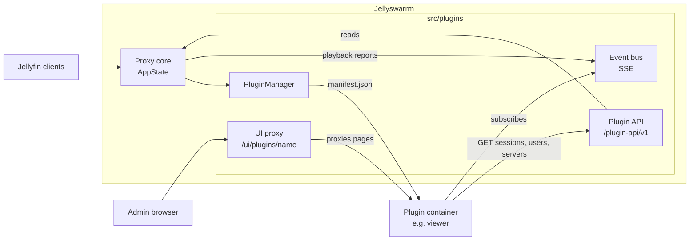

# Plugins

Jellyswarrm plugins are separate services that extend Jellyswarrm without
changing its core. A small built-in **PluginManager** connects them to the proxy:
it hands out events, answers read-only API requests, and mounts plugin pages in
the admin UI.

> Status: design. Nothing described here is implemented yet. See the
> [roadmap](ROADMAP.md) for the implementation steps.

## Goals

* **Extend without forking the core.** New features such as a "who is watching
  right now" view live in plugins, not in Jellyswarrm's own code.
* **Stay independent of upstream internals.** Plugins only use a versioned
  [plugin API](plugin-api-v1.md). When Jellyswarrm's internals change, only the
  PluginManager has to be adjusted, never the plugins.
* **Any language, any deployment.** A plugin is just an HTTP service, typically
  its own container next to Jellyswarrm.
* **Safe by default.** Plugins are enabled explicitly per plugin, the API is
  read-only, and plugin pages are only reachable for logged-in admins.
* **First plugin: the viewer.** Show who is currently watching what, across all
  backend servers.

## Non-goals (v1)

* Modifying proxied requests or responses.
* Write access (creating users, changing servers, controlling playback).
* Loading code into the Jellyswarrm process (no dynamic libraries, no WASM).
* A plugin marketplace or install UI. Plugins are configured in
  `jellyswarrm.toml`.
* Running Jellyfin server plugins. Jellyswarrm only looks like a Jellyfin server
  to clients.

## Architecture

* **PluginManager** reads the `[[plugins]]` list from the config, fetches each
  plugin's `manifest.json`, checks the API version, and tracks the plugin's
  status.
* **Plugin API** exposes selected data from `AppState` as stable JSON objects
  (DTOs). `AppState` itself never leaves the process.
* **Event bus** publishes playback events as Server-Sent Events. Publishing never
  blocks the proxy.
* **UI proxy** serves a plugin's pages under the admin UI and adds a tab for each
  plugin that has a UI.

## Documents

* [Deploying with Docker Compose](docker-compose.md): step-by-step setup with the viewer plugin.
* [Plugin API v1](plugin-api-v1.md): the contract for plugin authors.
* [Roadmap](ROADMAP.md): implementation steps and acceptance criteria.
* Decisions:
  * [0001 External plugins](decisions/0001-external-plugins.md)
  * [0002 PluginManager as a bridge](decisions/0002-pluginmanager-as-bridge.md)
  * [0003 Registration and manifest](decisions/0003-registration-and-manifest.md)
  * [0004 Authentication with tokens](decisions/0004-auth-tokens.md)
  * [0005 Events via Server-Sent Events](decisions/0005-events-via-sse.md)
  * [0006 Plugin UI via reverse proxy](decisions/0006-ui-via-reverse-proxy.md)
  * [0007 Fork hygiene](decisions/0007-fork-hygiene.md)

## Glossary

| Term | Meaning |
|---|---|
| Core | The existing Jellyswarrm proxy code outside `src/plugins/`. |
| Plugin | An external HTTP service registered in `[[plugins]]`. |
| PluginManager | The module in `src/plugins/` that connects core and plugins. |
| Manifest | `manifest.json` served by a plugin, describing name, version, API version and UI. |
| DTO | A plain JSON object of the plugin API, independent of internal Rust types. |
